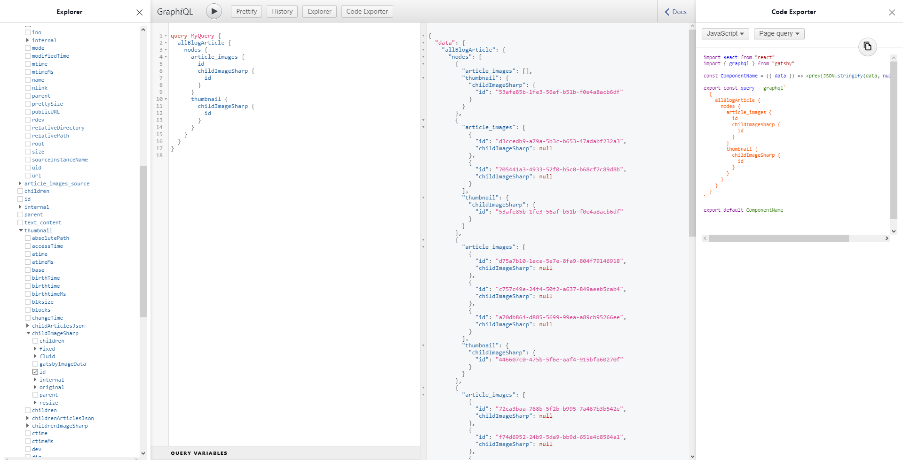

# Gatsby breaking node links demo

This demo repo is a modified clone of the `gatsby-starter-blog`.
"Article"-data is stored under `./src/data/articles.json`.
They get picked up by `gatsby-source-filesystem` and transformed into nodes by `gatsby-transformer-json`.

Then in `gatsby-node.js` all articles get mapped and re-transformed into `BlogArticle`-nodes using the `sourceNodes` API.
While doing this, the referenced images get pulled via `createRemoteFileNode` and they themselves get referenced to the `BlogArticle`-node, by mapping all image nodes that are created this way.
`const articleNode = await createNode({ article_images_source: images, article_images: all_article_image_nodes?.map(({ id }) => id), ... })`

Finally, they all get linked in `createSchemaCustomization`.
Like this:
`type BlogArticle implements Node { article_images: [File] @link, thumbnail: File @link }`

## Breaking the build

The first build (and all consecutive build w/out changes) will run just fine, all articles and images will show up. If you then however make a change to one of the `images`-arrays inside the `articles.json` file, all image links will break and the build will crash. I just cut one of the referenced images from the array and paste the whole object into the `blog-article.js` and comment it out, so I can alternate between the two version relatively hassle free...
**DON'T paste it into the gatsby-node.js-file though, since this will invalidate the cache and keep the build running!**

`gatsby develop` will still run, giving a hint in whats going on:

### Working gatsby dev:

Notice how all `article_images`-nodes have an ID and also each one has a `childImageSharp`-node with an own ID.

### Crashing gatsby dev after changing the content:

Notice how all `article_images`-nodes have an ID, but `childImageSharp` is always `null`.
One more very interesting fact: all `thumbnail` nodes are still there and all still have their `childImageSharp` referenced correctly.

## My "fix"

In `gatsby-node` you can see some commented code, that sort of manually gets cached image nodes and links those to the `BlogArticle`-nodes. You can see this working when you un-comment these lines (the code ones of course, not the "actual" comments 😉) and then build -> make said change to the `articles.json` -> DONT delete the cache or make a change to one of the API files -> rebuild w/ cache -> profit.

## Additional info

The flag `PRESERVE_FILE_DOWNLOAD_CACHE` is active, because in our production project, we're talking thousands of remotely stored images. Would be a shame to lose the cache every time someone adds a mere comment inside `gatsby-node.js`

I did this re-transforming of already created json nodes, because in our production project, articles are stored in a Cloud-Storage and fetched when building, thus making this necessary for reproducing the error.
